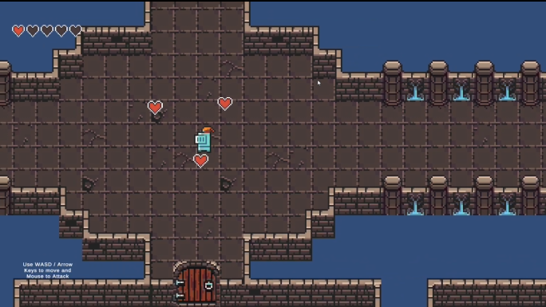
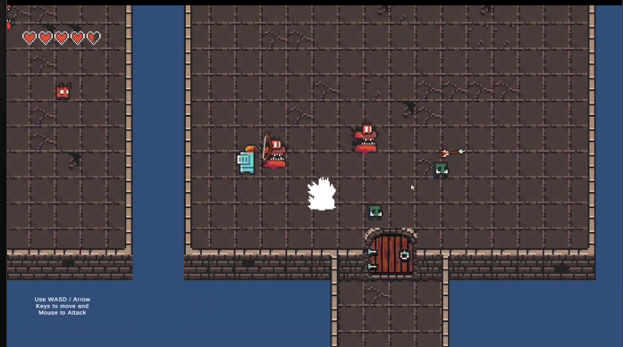
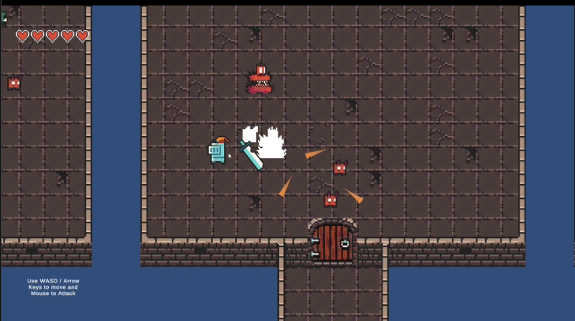

# Routecore

**Project for the course "Design and construction of digital games - DIT075" (GU).**

*A retro-style dungeon crawler where every choice matters.*

  
  

## Gameplay
In **Routecore**, the player must navigate a dungeon, choosing between three distinct paths at each stage. Each path offers unique monsters and rewards, making every decision impactful.

### **Controls**
- **Move**: `WASD` or arrow keys.
- **Attack**: Mouse (directional).

### **Game Mechanics**
- Once a path is chosen, there is no going back—doors lock behind the player.
- Each room must be cleared of all monsters before the exit opens.
- The game is won by reaching and defeating the final room of the dungeon.

## **Features**
- **Challenging combat** – Inspired by rogue-like mechanics.
- **Meaningful choices** – Select paths based on rewards like weapons or healing.
- **Retro pixel art aesthetic** – Classic dungeon-crawling feel.

## **Development & Future Plans**
Originally, we planned for procedurally generated levels, but due to time constraints, the game currently features **one handcrafted level** with **three types of monsters**. If further developed, we would expand the game with:
- More levels.
- Additional monster types.
- More varied rewards.
- Improve animations for the player.

## Credits

- Sprites downloaded from [0x72's Dungeon Tileset II.](https://0x72.itch.io/dungeontileset-ii).
- Sword sound effect: Downloaded  from [Mixkit](Mixkit.co).
- Background Music: "Hopeless" from [Pixabay](https://pixabay.com/music/build-up-scenes-hopeless-119866/).